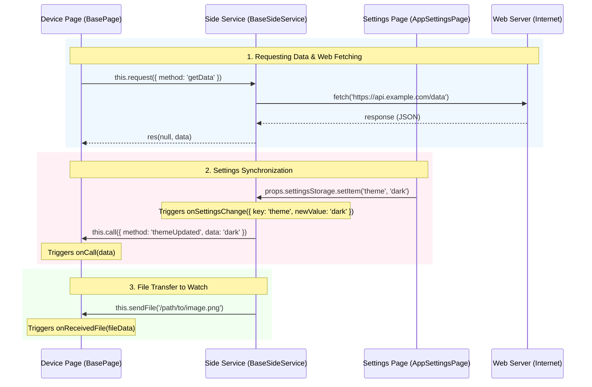

# ZML (ZeppOS Middleware Library)

Welcome to the ZML documentation. ZML is a modular, plugin-based middleware designed to simplify development on ZeppOS by bridging the communication gaps between watch pages, phone side services, settings pages, and internet APIs.

---

## Architectural & Data Flow Overview

ZML coordinates execution across four main areas: the **Device Page**, the **Device App**, the **Phone Side Service**, and the **Phone Settings Page**.



---

## Core Scenarios & Code Examples

### 1. Watch Page -> Phone Side Service -> Internet API Fetch
Because ZeppOS device-side has limited network access, internet requests are sent to the Side Service, which fetches data from the web and returns it.

*   **Watch Page (`page/index.js`)**:
    ```javascript
    this.request({
      method: 'fetchWeatherData',
      params: { city: 'London' }
    })
      .then(data => console.log('Weather:', data))
      .catch(err => console.error('Error:', err))
    ```
*   **Phone Side Service (`app-side/index.js`)**:
    ```javascript
    onRequest(req, res) {
      if (req.method === 'fetchWeatherData') {
        this.fetch({ url: `https://api.weather.com?city=${req.params.city}` })
          .then(result => res(null, result.body))
          .catch(err => res({ code: 500, message: err.message }))
      }
    }
    ```

### 2. Settings Update -> Side Service -> Watch Page Notification
When settings are modified on the companion app configuration screen, the changes are synchronized to the Side Service and can be pushed to the watch UI.

*   **Phone Settings Page (`setting/index.js`)**:
    ```javascript
    props.settingsStorage.setItem('username', 'Alice')
    ```
*   **Phone Side Service (`app-side/index.js`)**:
    ```javascript
    onSettingsChange({ key, newValue }) {
      if (key === 'username') {
        this.call({ method: 'usernameChanged', params: { username: newValue } })
      }
    }
    ```
*   **Watch Page (`page/index.js`)**:
    ```javascript
    onCall(data) {
      if (data.method === 'usernameChanged') {
        console.log('New username on watch:', data.params.username)
      }
    }
    ```

### 3. File Transfer from Phone to Watch
Large resources (images, database files) are transferred asynchronously using the dedicated file transfer protocol.

*   **Phone Side Service (`app-side/index.js`)**:
    ```javascript
    this.sendFile('/data/avatar.png')
    ```
*   **Watch Page (`page/index.js`)**:
    ```javascript
    onReceivedFile(fileData) {
      console.log('Received file at path:', fileData.filePath)
    }
    ```

---

## Table of Contents

### Getting Started
*   [Getting Started](getting-started.md) - Installation and basic structure (Apps/Pages).

### Core Library
*   [Core Concepts](core-concepts.md) - Architecture and plugin system.
*   [Shared Utilities](shared-utilities.md) - Polyfills, helpers, and base utilities.

### Advanced Usage & Architecture
*   [Architecture & Data Flow](advanced-guides.md) - High-level overview of Device/App-side communication and synchronization.
*   [Best Practices](best-practices.md) - Recommended development patterns for performance and stability.

### API Reference
*   [BasePage Reference](base-page-reference.md) - Detailed guide for Device-side pages.
*   [BaseSideService Reference](base-side-service-reference.md) - Detailed guide for App-side services.
*   [AppSettingsPage Reference](app-settings-page.md) - Detailed guide for Phone-side settings page.

### Support
*   [Troubleshooting & FAQ](troubleshooting-faq.md) - Common issues and questions.
